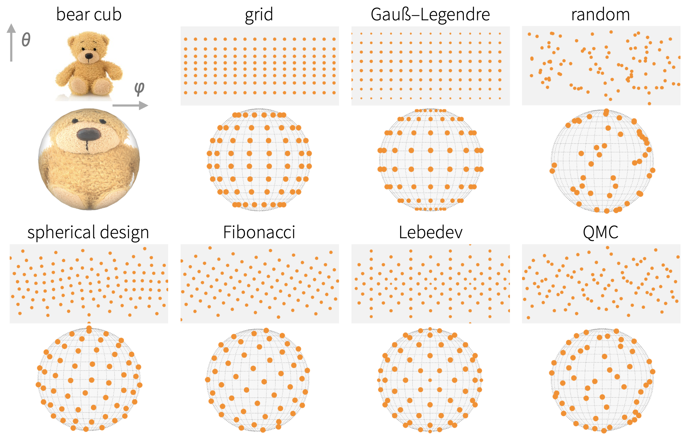

---
output:
  github_document
---

<!-- README.md is generated from README.Rmd. Please edit that file -->

```{r, include = FALSE}
knitr::opts_chunk$set(
  collapse = TRUE,
  comment = "#>",
  fig.path = "man/figures/README-",
  out.width = "100%"
)
library(ggplot2)
library(cubs)
```

# cubs - Integrate functions numerically on the sphere (S2)

`cubs` is a utility package wrapping several commonly-used spherical cubature rules in a convenient interface:

* `Lebedev` 
* `Spherical t-Designs`
* `Gauß-Legendre`
* `Fibonacci`
* `grid`
* `Quasi Monte-Carlo`
* `random`
  


## Installation

You can install from [GitHub](https://github.com/nano-optics/cubs) with:

``` r
# install.package('remotes')
remotes::install_github('nano-optics/cubs')
```

## Simple example

Let's request a Lebedev cubature with approximately 10 points,

``` r
cubs(N = 10, 'lebedev')
```

```{r demo, message=FALSE, echo=FALSE, results='asis', warning=FALSE}
d <- cubs(N = 10, 'lebedev')
rownames(d) <- paste(1:nrow(d))
print(knitr::kable(d, row.names = 1:nrow(d),
                   caption = 'Lebedev, 10 points requested'))
```

Let's try a known integrand,

$$
f_{1}(x, y, z)= 1+x+y^{2}+x^{2} y + x^{4}+y^{5}+x^{2} y^{2} z^{2}
$$

with the usual spherical coordinates,

\begin{align}
x = &\cos(\varphi)\sin(\theta)\\
y = & \sin(\varphi)\sin(\theta)\\
z = & \cos(\theta).
\end{align}

We want to estimate the integral
$$
I = \frac{1}{4\pi}\int_0^{\pi} \int_0^{2\pi}  f(\varphi,\theta)  \sin\theta\, \mathrm{d} \varphi \mathrm{d} \theta .
$$
numerically, i.e. with a spherical cubature
$$
I \approx  \sum_{\varphi_i,\theta_i}^{i=1\dots N} f(\varphi_i,\theta_i) w_i,
$$

```{r testfun, echo=FALSE}
f <- function(phi, theta){
  
  x <- cos(phi)*sin(theta)
  y <- sin(phi)*sin(theta)
  z <- cos(theta)
  
  1+x+y^2 +x^2*y+x^4 +y^5 +x^2*y^2*z^2
}


g <- expand.grid(phi=seq(0,2*pi,length=360), theta=seq(0,pi,length=180))

g$f <- f1(g$phi,g$theta)
ggplot(g, aes(phi, theta, fill=f)) +
  geom_raster() +
  coord_equal()+
  scale_fill_viridis_c() +
  theme_bw() +
  theme(legend.position = 'none', panel.spacing.x = unit(3,'mm'),
        axis.text.x = element_text(vjust=0.5)) +
  scale_x_continuous(expand=c(0,0), breaks=seq(0,2,by=1/2)*pi, labels=expression(0,pi/2,pi,3*pi/2,2*pi)) +
  scale_y_continuous(expand=c(0,0), breaks=seq(0,1,by=1/4)*pi, labels=expression(0,pi/4,pi/2,3*pi/4,pi)) +
  labs(x=expression(varphi), y=expression(theta))
```

We compare the exact value, $216 \pi / 35$, to the Lebedev cubature for increasing number of points.

```{r error, results='asis', echo=FALSE}

exact <- 216*pi/35

q1 <- cubs(10, 'lebedev')
approx1 <- 4*pi*sum(f1(q1$phi, q1$theta) * q1$weight)
q2 <- cubs(20, 'lebedev')
approx2 <- 4*pi*sum(f1(q2$phi, q2$theta) * q2$weight)
                 
# library(cubature)
# num <- hcubature(function(x) sin(x[2]) * f(x[1],x[2]) , c(0,0), c(2*pi, pi), maxEval = 1e4)
# adapt <- num$integral

comparison <- data.frame(source = c('lebedev N=14', 'lebedev N=26', 'exact'), 
                         value = as.character(round(c(approx1, approx2, exact), digits = 15)))
print(knitr::kable(comparison))
```


## Acknowledgements

This package merely wraps existing rules in a convenient interface; the original cubature points were obtained from:

- `Lebedev`:  [from John Burkardt's webpage](https://people.sc.fsu.edu/~jburkardt/c_src/sphere_lebedev_rule/sphere_lebedev_rule.html), using the `SPHERE_LEBEDEV_RULE` C routine. The routine itself implements the original reference by Lebedev and Laikov

    Vyacheslav Lebedev, Dmitri Laikov,
    A quadrature formula for the sphere of the 131st
    algebraic order of accuracy,
    Russian Academy of Sciences Doklady Mathematics,
    Volume 59, Number 3, 1999, pages 477-481.

- `Spherical t-Designs`: [from Rob Womersley's webpage](https://web.maths.unsw.edu.au/~rsw/Sphere/EffSphDes/), using the provided tables of Spherical t-designs (SF29-Nov-2012). 

- `Gauß-Legendre`: we use the `gauss.quad` routine from the `statmod` package to compute 1D quadrature nodes on $[-1,1]$, and take a cartesian product with a mid-point rule along $\varphi$.

- `QMC`: we use the `halton` routine from the `randtoolbox` package to generate a 2D low-discrepancy sequence of points in $[0,1]\times[0,1]$.

`Fibonacci`, `grid`, and `random` are implemented directly in the package.


