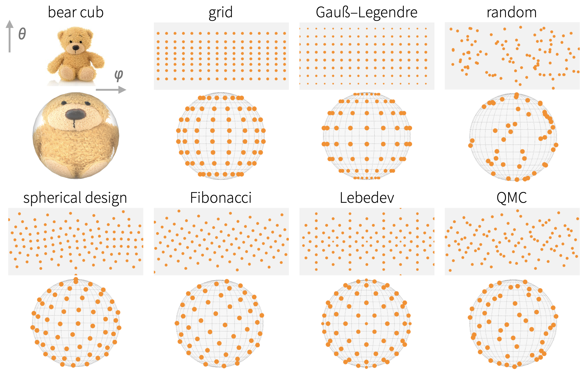

<!-- README.md is generated from README.Rmd. Please edit that file -->

# cubs - Integrate functions numerically on the sphere (S2)

`cubs` is a utility package wrapping several commonly-used spherical
cubature rules in a convenient interface:

-   `Lebedev`
-   `Spherical t-Designs`
-   `Gauß-Legendre`
-   `Fibonacci`
-   `grid`
-   `Quasi Monte-Carlo`
-   `random`



## Installation

You can install from [GitHub](https://github.com/nano-optics/cubs) with:

``` r
# install.package('remotes')
remotes::install_github('nano-optics/cubs')
```

## Simple example

Let’s request a Lebedev cubature with approximately 10 points,

``` r
cubs(N = 10, 'lebedev')
```

|     |        phi |     theta |    weight |
|:----|-----------:|----------:|----------:|
| 1   |  0.0000000 | 1.5707963 | 0.0666667 |
| 2   |  3.1415927 | 1.5707963 | 0.0666667 |
| 3   |  1.5707963 | 1.5707963 | 0.0666667 |
| 4   | -1.5707963 | 1.5707963 | 0.0666667 |
| 5   |  1.5707963 | 0.0000000 | 0.0666667 |
| 6   |  1.5707963 | 3.1415927 | 0.0666667 |
| 7   |  0.7853982 | 0.9553166 | 0.0750000 |
| 8   |  0.7853982 | 2.1862760 | 0.0750000 |
| 9   | -0.7853982 | 0.9553166 | 0.0750000 |
| 10  | -0.7853982 | 2.1862760 | 0.0750000 |
| 11  |  2.3561945 | 0.9553166 | 0.0750000 |
| 12  |  2.3561945 | 2.1862760 | 0.0750000 |
| 13  | -2.3561945 | 0.9553166 | 0.0750000 |
| 14  | -2.3561945 | 2.1862760 | 0.0750000 |

Lebedev, 10 points requested

Let’s try a known integrand,

*f*<sub>1</sub>(*x*, *y*, *z*) = 1 + *x* + *y*<sup>2</sup> + *x*<sup>2</sup>*y* + *x*<sup>4</sup> + *y*<sup>5</sup> + *x*<sup>2</sup>*y*<sup>2</sup>*z*<sup>2</sup>

with the usual spherical coordinates,

We want to estimate the integral
$$
I = \\frac{1}{4\\pi}\\int\_0^{\\pi} \\int\_0^{2\\pi}  f(\\varphi,\\theta)  \\sin\\theta\\, \\mathrm{d} \\varphi \\mathrm{d} \\theta .
$$
numerically, i.e. with a spherical cubature
$$
I \\approx  \\sum\_{\\varphi\_i,\\theta\_i}^{i=1\\dots N} f(\\varphi\_i,\\theta\_i) w\_i,
$$


We compare the exact value, 216*π*/35, to the Lebedev cubature for
increasing number of points.

| source       | value            |
|:-------------|:-----------------|
| lebedev N=14 | 19.5476876223365 |
| lebedev N=26 | 19.3881146621542 |
| exact        | 19.3881146621542 |

## Acknowledgements

This package merely wraps existing rules in a convenient interface; the
original cubature points were obtained from:

-   `Lebedev`: [from John Burkardt’s
    webpage](https://people.sc.fsu.edu/~jburkardt/c_src/sphere_lebedev_rule/sphere_lebedev_rule.html),
    using the `SPHERE_LEBEDEV_RULE` C routine. The routine itself
    implements the original reference by Lebedev and Laikov

    Vyacheslav Lebedev, Dmitri Laikov, A quadrature formula for the
    sphere of the 131st algebraic order of accuracy, Russian Academy of
    Sciences Doklady Mathematics, Volume 59, Number 3, 1999, pages
    477-481.

-   `Spherical t-Designs`: [from Rob Womersley’s
    webpage](https://web.maths.unsw.edu.au/~rsw/Sphere/EffSphDes/),
    using the provided tables of Spherical t-designs (SF29-Nov-2012).

-   `Gauß-Legendre`: we use the `gauss.quad` routine from the `statmod`
    package to compute 1D quadrature nodes on \[ − 1, 1\], and take a
    cartesian product with a mid-point rule along *φ*.

-   `QMC`: we use the `halton` routine from the `randtoolbox` package to
    generate a 2D low-discrepancy sequence of points in
    \[0, 1\] × \[0, 1\].

`Fibonacci`, `grid`, and `random` are implemented directly in the
package.
