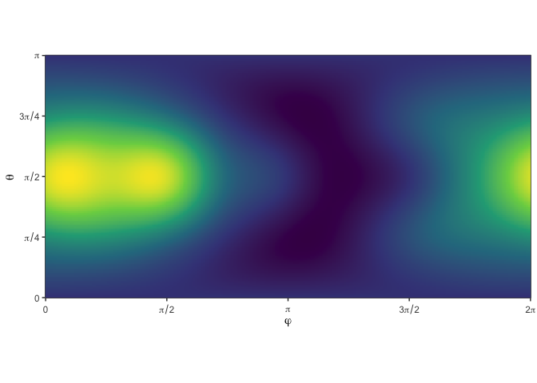

<!-- README.md is generated from README.Rmd. Please edit that file -->

# cubs - Integrate functions numerically on the sphere (S2)

`cubs` is a utility package to wrap several commonly-used spherical
cubature rules in a convenient interface:

-   `Lebedev`
-   `Spherical t-Designs`
-   `Gauß-Legendre`
-   `Fibonacci`
-   `grid`
-   `Quasi Monte-Carlo`
-   `random`

## Installation

You can install from [GitHub](https://github.com/nano-optics/cubs) with:

``` r
# install.package('remotes')
remotes::install_github('nano-optics/cubs')
```

## Simple example

Let’s request a Lebedev cubature with approximately 15 points,

``` r
cubs(N = 10, 'lebedev')
```

|     |        phi |     theta |    weight |
|:----|-----------:|----------:|----------:|
| 1   |  0.0000000 | 1.5707963 | 0.0666667 |
| 2   |  3.1415927 | 1.5707963 | 0.0666667 |
| 3   |  1.5707963 | 1.5707963 | 0.0666667 |
| 4   | -1.5707963 | 1.5707963 | 0.0666667 |
| 5   |  1.5707963 | 0.0000000 | 0.0666667 |
| 6   |  1.5707963 | 3.1415927 | 0.0666667 |
| 7   |  0.7853982 | 0.9553166 | 0.0750000 |
| 8   |  0.7853982 | 2.1862760 | 0.0750000 |
| 9   | -0.7853982 | 0.9553166 | 0.0750000 |
| 10  | -0.7853982 | 2.1862760 | 0.0750000 |
| 11  |  2.3561945 | 0.9553166 | 0.0750000 |
| 12  |  2.3561945 | 2.1862760 | 0.0750000 |
| 13  | -2.3561945 | 0.9553166 | 0.0750000 |
| 14  | -2.3561945 | 2.1862760 | 0.0750000 |

Lebedev, 10 points requested

Let’s try a known integrand,

*f*<sub>1</sub>(*x*, *y*, *z*) = 1 + *x* + *y*<sup>2</sup> + *x*<sup>2</sup>*y* + *x*<sup>4</sup> + *y*<sup>5</sup> + *x*<sup>2</sup>*y*<sup>2</sup>*z*<sup>2</sup>

with the usual spherical coordinates.

We want to estimate the integral
<?xml version="1.0" encoding="utf-8" standalone="no"?>
<math xmlns="http://www.w3.org/1998/Math/MathML" display="block" title="I = \frac{1}{4\pi}\int_0^{\pi} \int_0^{2\pi}  f(\varphi,\theta)  \sin\theta\, \mathrm{d} \varphi \mathrm{d} \theta ">
  <mrow>
    <mi>I</mi>
    <mo>=</mo>
    <mfrac>
      <mrow>
        <mn>1</mn>
      </mrow>
      <mrow>
        <mn>4</mn>
        <mi>π</mi>
      </mrow>
    </mfrac>
    <msubsup>
      <mo largeop="true">∫</mo>
      <mrow>
        <mn>0</mn>
      </mrow>
      <mrow>
        <mi>π</mi>
      </mrow>
    </msubsup>
    <msubsup>
      <mo largeop="true">∫</mo>
      <mrow>
        <mn>0</mn>
      </mrow>
      <mrow>
        <mn>2</mn>
        <mi>π</mi>
      </mrow>
    </msubsup>
    <mi>f</mi>
    <mo stretchy="false">(</mo>
    <mi>φ</mi>
    <mo>,</mo>
    <mi>θ</mi>
    <mo stretchy="false">)</mo>
    <mo>sin</mo>
    <mi>θ</mi>
    <mspace width="0.167em"/>
    <mtext mathvariant="normal">
      <mi>d</mi>
    </mtext>
    <mi>φ</mi>
    <mtext mathvariant="normal">
      <mi>d</mi>
    </mtext>
    <mi>θ</mi>
  </mrow>
</math>
numerically, i.e. with a spherical cubature

<?xml version="1.0" encoding="utf-8" standalone="no"?>
<math xmlns="http://www.w3.org/1998/Math/MathML" display="block" title="I \approx  \sum_{\varphi_i,\theta_i}^{i=1\dots N} f(\varphi_i,\theta_i) w_i ">
  <mrow>
    <mi>I</mi>
    <mo>≈</mo>
    <munderover>
      <mo largeop="true">∑</mo>
      <mrow>
        <msub>
          <mrow>
            <mi>φ</mi>
          </mrow>
          <mrow>
            <mi>i</mi>
          </mrow>
        </msub>
        <mo>,</mo>
        <msub>
          <mrow>
            <mi>θ</mi>
          </mrow>
          <mrow>
            <mi>i</mi>
          </mrow>
        </msub>
      </mrow>
      <mrow>
        <mi>i</mi>
        <mo>=</mo>
        <mn>1</mn>
        <mo>…</mo>
        <mi>N</mi>
      </mrow>
    </munderover>
    <mi>f</mi>
    <mo stretchy="false">(</mo>
    <msub>
      <mrow>
        <mi>φ</mi>
      </mrow>
      <mrow>
        <mi>i</mi>
      </mrow>
    </msub>
    <mo>,</mo>
    <msub>
      <mrow>
        <mi>θ</mi>
      </mrow>
      <mrow>
        <mi>i</mi>
      </mrow>
    </msub>
    <mo stretchy="false">)</mo>
    <msub>
      <mrow>
        <mi>w</mi>
      </mrow>
      <mrow>
        <mi>i</mi>
      </mrow>
    </msub>
  </mrow>
</math>



We compare the exact value, 216*π*/35, to the Lebedev cubature for
increasing number of points.

| source       | value            |
|:-------------|:-----------------|
| lebedev N=14 | 19.5476876223365 |
| lebedev N=26 | 19.3881146621542 |
| exact        | 19.3881146621542 |
